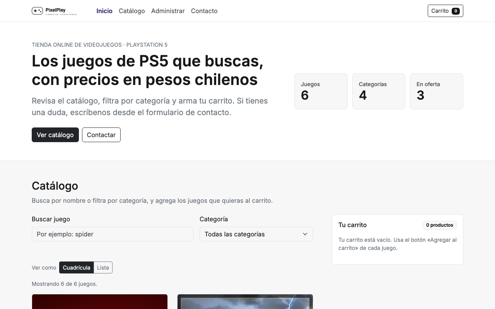
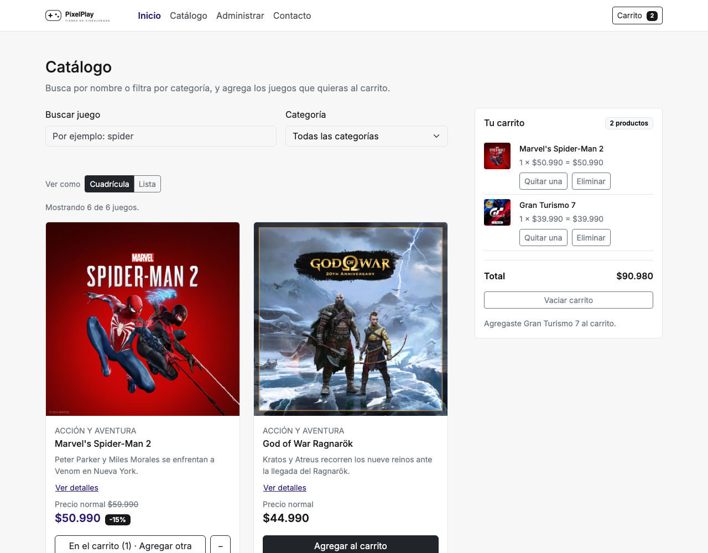
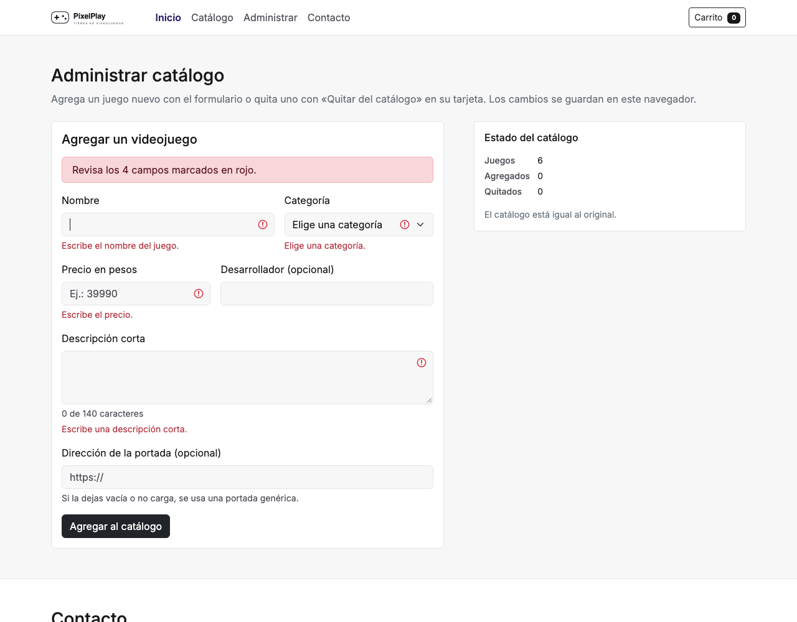
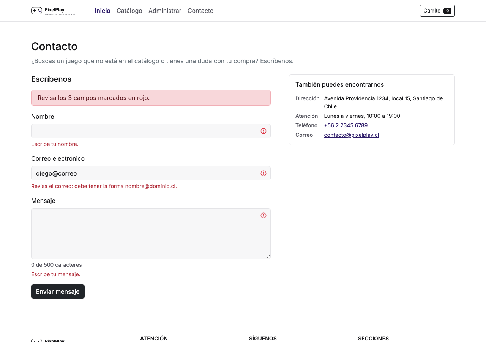

# PixelPlay Store

Tienda online de videojuegos para PlayStation 5, construida con **React 19**, **Vite**, **Bootstrap 5**,
**JavaScript** y **CSS** propio. Proyecto de la Evaluación Final Transversal de **Desarrollo Frontend I
(PFY2201)**, Duoc UC.

- **Sitio publicado:** https://dcarvajal99.github.io/tienda-videojuegos-pfy2201/
- **Repositorio:** https://github.com/dcarvajal99/tienda-videojuegos-pfy2201



---

## Contenido

1. [Qué hace el sitio](#qué-hace-el-sitio)
2. [Tecnologías](#tecnologías)
3. [Instalación](#instalación)
4. [Uso del sitio](#uso-del-sitio)
5. [Scripts disponibles](#scripts-disponibles)
6. [Estructura del proyecto](#estructura-del-proyecto)
7. [Componentes, estado y props](#componentes-estado-y-props)
8. [Datos](#datos)
9. [Diseño responsivo y accesibilidad](#diseño-responsivo-y-accesibilidad)
10. [Verificación](#verificación)
11. [Publicación en GitHub Pages](#publicación-en-github-pages)
12. [Historial del proyecto](#historial-del-proyecto)

---

## Qué hace el sitio

| Sección | Funcionalidad |
|---|---|
| **Barra de navegación** | Enlaces a Inicio, Catálogo, Administrar y Contacto; marca la sección visible; muestra cuántos productos hay en el carrito. En teléfonos se pliega detrás de un botón. |
| **Inicio** | Presentación de la tienda y tres cifras del catálogo (juegos, categorías y ofertas) que se actualizan solas. |
| **Catálogo** | Tarjetas con imagen, nombre, categoría, descripción y precio (normal y de oferta), generadas desde los datos. Búsqueda por texto, filtro por categoría y vista en cuadrícula o en lista. |
| **Carrito** | Agregar, quitar unidades, eliminar y vaciar (con confirmación). Contador y total en pesos chilenos. Se guarda en el navegador. |
| **Administrar** | Formulario para agregar un videojuego nuevo al catálogo y botón «Quitar del catálogo» en cada tarjeta. Los cambios se guardan en el navegador y se pueden deshacer con «Restablecer catálogo original». |
| **Contacto** | Formulario con nombre, correo y mensaje que se valida antes de enviar y explica cada error. El envío es simulado: no hay servidor. |
| **Pie de página** | Dirección, horario, teléfono, correo, redes sociales y enlaces a las secciones. |

## Tecnologías

| Tecnología | Uso |
|---|---|
| **React 19** | Componentes funcionales, `useState`, `useEffect`, `useMemo`, `useRef` y hooks propios. |
| **Vite 8** | Servidor de desarrollo y compilación para producción. |
| **Bootstrap 5.3.8** (CDN) | Barra de navegación, tarjetas, formularios, botones, alertas, insignias y grilla responsiva. |
| **CSS propio** (`src/estilos.css`) | Paleta de la marca, **CSS Grid** (cifras de la portada y pie de página) y **Flexbox** (vista de lista, botones y filas del carrito). |
| **JavaScript** | Carga de datos con `fetch`, filtros, validación de formularios, `localStorage` e `IntersectionObserver`. |
| **gh-pages** | Publicación en GitHub Pages con `npm run deploy`. |
| **oxlint** | Revisión estática del código. |

## Instalación

### Requisitos

- [Node.js](https://nodejs.org/) **20.19 o superior** (incluye npm).
- Git, para clonar el repositorio.

### Pasos

```bash
git clone https://github.com/dcarvajal99/tienda-videojuegos-pfy2201.git
cd tienda-videojuegos-pfy2201
npm install
npm run dev
```

Vite muestra la dirección local; ábrela en el navegador:

```
http://localhost:5173/tienda-videojuegos-pfy2201/
```

> La ruta termina en `/tienda-videojuegos-pfy2201/` porque el proyecto está configurado para publicarse en
> esa subcarpeta de GitHub Pages (ver `vite.config.js`).

### Versión de producción

```bash
npm run build     # compila en la carpeta dist/
npm run preview   # sirve dist/ en http://localhost:4173/tienda-videojuegos-pfy2201/
```

## Uso del sitio

1. **Navegar:** usa la barra superior para ir a cada sección. En el teléfono, abre el menú con el botón ☰
   (se cierra al elegir una sección o con la tecla Escape).
2. **Buscar y filtrar:** escribe en «Buscar juego» (busca por nombre, descripción o desarrollador, sin
   importar tildes ni mayúsculas) o elige una categoría. La búsqueda se aplica cuando dejas de escribir.
3. **Ver detalles:** «Ver detalles» muestra el desarrollador, la plataforma y el descuento de cada juego.
4. **Comprar:** «Agregar al carrito» confirma con «✓ Agregado» y luego cambia a «En el carrito (n)». El
   botón «−» quita una unidad. El panel del carrito muestra el total y permite eliminar líneas o vaciarlo.
5. **Agregar un videojuego:** en «Administrar catálogo», completa nombre, categoría, precio y descripción
   (el desarrollador y la imagen son opcionales) y pulsa «Agregar al catálogo».
6. **Quitar un videojuego:** pulsa «Quitar del catálogo» en su tarjeta y confirma.
7. **Volver al catálogo original:** «Restablecer catálogo original» borra los juegos agregados y devuelve
   los quitados.
8. **Escribir a la tienda:** completa el formulario de contacto. Si falta un dato o el correo no es válido,
   el campo se marca en rojo con la explicación y el foco va al primero con problemas.

| Catálogo con carrito | Administrar catálogo | Contacto |
|---|---|---|
|  |  |  |

## Scripts disponibles

| Comando | Qué hace |
|---|---|
| `npm run dev` | Servidor de desarrollo con recarga automática. |
| `npm run build` | Compila la versión de producción en `dist/`. |
| `npm run preview` | Sirve `dist/` para revisarla tal como quedará publicada. |
| `npm run lint` | Revisa el código con oxlint. |
| `npm run deploy` | Compila y publica `dist/` en la rama `gh-pages`. |
| `npm run test:navegadores` | Corre las pruebas en Chrome, Brave, Firefox y Safari (macOS; requiere `npm run build` antes). |

## Estructura del proyecto

```
tienda-videojuegos-pfy2201/
├── index.html                  Página que monta React (carga Bootstrap e Inter desde CDN)
├── package.json                Dependencias y scripts
├── vite.config.js              Configuración de Vite y ruta de publicación
├── public/
│   ├── productos.json          Catálogo: categorías y videojuegos
│   ├── img/                    Portadas, logotipo y portada genérica
│   └── react/index.html        Redirige la dirección antigua /react/ a la nueva
├── src/
│   ├── main.jsx                Punto de entrada
│   ├── App.jsx                 Componente raíz: estado de la página y conexión entre secciones
│   ├── estilos.css             Estilos propios sobre Bootstrap
│   ├── componentes/            17 componentes funcionales
│   ├── hooks/                  7 hooks propios
│   ├── utilidades/             Funciones de formato, catálogo, carrito y validación
│   └── datos/tienda.js         Datos de contacto de la tienda
├── pruebas/                    Pruebas en navegadores y sus resultados
└── capturas/                   Capturas de cada entrega (semana-6, semana-7, semana-8 y eft)
```

## Componentes, estado y props

`App` reúne el estado que comparten varias secciones y lo reparte con **props**. Por eso un cambio en un
componente se refleja en los demás: al agregar un juego en «Administrar», la lista del catálogo, el filtro
de categorías, las cifras de la portada y el estado de la administración se actualizan juntos.

```
App ─┬─ BarraNavegacion      ← secciones, sección visible, unidades del carrito
     ├─ Portada              ← juegos, categorías y ofertas
     ├─ Filtros              ← búsqueda y categoría (avisa con onBuscar y onCategoria)
     ├─ SelectorVista        ← vista (avisa con onCambiar)
     ├─ ListaProductos ── TarjetaProducto ── ImagenJuego, BotonConConfirmacion
     ├─ Carrito ── FilaCarrito, BotonConConfirmacion
     ├─ SeccionAdministrar ── FormularioVideojuego ── Campo
     ├─ SeccionContacto ── FormularioContacto ── Campo
     └─ PiePagina            ← secciones y datos de la tienda
```

### Componentes

| Componente | Responsabilidad |
|---|---|
| `BarraNavegacion` | Navbar de Bootstrap con menú plegable controlado por estado. |
| `Portada` | Sección de inicio con las cifras del catálogo. |
| `Filtros`, `SelectorVista` | Búsqueda, categoría y vista (cuadrícula o lista). |
| `ListaProductos`, `TarjetaProducto` | Recorren el catálogo con `map()` y dibujan cada tarjeta. |
| `Carrito`, `FilaCarrito` | Panel del carrito con sus líneas, contador y total. |
| `SeccionAdministrar`, `FormularioVideojuego` | Agregar videojuegos y restablecer el catálogo. |
| `SeccionContacto`, `FormularioContacto` | Formulario de contacto validado y datos de la tienda. |
| `PiePagina` | Pie de página con CSS Grid. |
| `Campo` | Campo de formulario reutilizable (etiqueta, control y error). |
| `BotonConConfirmacion` | Botón que pide confirmar antes de borrar algo. |
| `ImagenJuego` | Portada con reemplazo automático si la imagen no carga. |
| `Aviso` | Mensajes de carga, error (con «Reintentar») y sin resultados. |

### Hooks propios

| Hook | Qué guarda o hace |
|---|---|
| `useCatalogo` | Carga `productos.json` con `fetch` (`useEffect`) y aplica los juegos agregados y quitados. |
| `useCarrito` | Productos del carrito y sus cantidades; agregar, quitar, eliminar y vaciar. |
| `useEstadoGuardado` | `useState` que se guarda en `localStorage`; lo usan el catálogo y el carrito. |
| `useFormulario` | Valores, errores y momento de validar de cada formulario. |
| `useDebounce` | Aplica la búsqueda 300 ms después de la última tecla. |
| `useAccionBreve` | Pausa breve tras una acción: confirmación visible y sin clics repetidos. |
| `useSeccionVisible` | Detecta la sección a la vista con `IntersectionObserver`. |

## Datos

- **`public/productos.json`** es el objeto de JavaScript (en notación JSON) con las categorías y los
  videojuegos. Cada videojuego tiene `id`, `nombre`, `categoria`, `descripcion`, `desarrollador`,
  `precioNormal`, `precioOferta` (`null` si no está en oferta) e `imagen`. Se carga con `fetch` al abrir la
  página; si falla, el sitio muestra el error y un botón para reintentar.
- **`src/datos/tienda.js`** guarda los datos de contacto en un objeto que usan la sección de contacto y el
  pie de página.
- **`localStorage`** guarda dos claves: `pixelplay-react-carrito` (el carrito) y `pixelplay-react-catalogo`
  (juegos agregados y quitados). El archivo `productos.json` nunca se modifica. Los datos guardados que no
  tengan la forma esperada se descartan.

## Diseño responsivo y accesibilidad

- **Responsivo:** grilla de Bootstrap (una columna en teléfono, dos en tablet y escritorio, con el carrito al
  costado desde 992 px), menú plegable bajo 992 px y CSS Grid con `auto-fit` en el pie.
- **HTML semántico:** `header`, `nav`, `main`, `section`, `article`, `aside`, `address` y `footer`, con un
  solo `h1` y títulos `h2`/`h3` por sección.
- **Accesibilidad:** etiquetas en todos los campos, errores asociados con `aria-describedby` y
  `aria-invalid`, regiones `role="status"` que anuncian los cambios, `aria-expanded` en el menú y los
  detalles, `aria-pressed` en el selector de vista y foco visible. Cuando una acción hace desaparecer el
  botón enfocado, el foco pasa a un elemento cercano.

## Verificación

Resultados de `npm run test:navegadores` (detalle en [`pruebas/resultados.md`](pruebas/resultados.md)):

| Navegador | Versión | Ancho | Pruebas superadas |
|---|---|---|---|
| Chrome | 154 | 1280 px y 390 px | 11 de 11 en cada ancho |
| Brave | 149 | 1280 px | 11 de 11 |
| Firefox | 146 | 1280, 768 y 390 px | 11 de 11 en cada ancho |
| Safari | 26 | 1115 px | 11 de 11 |

- Barrido de anchos de 320 a 1680 px (cada 40 px): **sin desborde horizontal**.
- **Validador W3C:** `index.html` y el HTML que genera React (incluido un estado con errores en los dos
  formularios, una confirmación abierta y el menú desplegado) pasan sin errores ni advertencias.
- **oxlint:** sin advertencias.

Las pruebas cubren la carga del catálogo, el filtro por categoría, la búsqueda, el carrito (contador y
total), la validación y el envío del formulario de contacto, agregar y quitar videojuegos, el menú plegable,
el desborde horizontal y la ausencia de errores en la consola.

## Publicación en GitHub Pages

```bash
npm run deploy
```

El script compila el proyecto y publica `dist/` en la rama `gh-pages` con el paquete `gh-pages`. GitHub
Pages sirve esa rama en https://dcarvajal99.github.io/tienda-videojuegos-pfy2201/. La base
`/tienda-videojuegos-pfy2201/` de `vite.config.js` hace que los archivos se busquen en esa ruta.

## Historial del proyecto

El repositorio acompañó todo el semestre: cada entrega quedó registrada en sus commits.

| Entrega | Commit | Contenido |
|---|---|---|
| Semana 1 | `c3b4c21` | Estructura básica en HTML5 semántico. |
| Semana 2 | `a9a6094` | Hoja de estilos externa, modelo de cajas, paleta y formulario. |
| Semana 3 | `f3de792` | Sitio responsivo con CSS Grid y Flexbox. |
| Semana 4 | `e5a6676` | Bootstrap 5: navbar, carrusel, grilla y tarjetas. |
| Semana 5 | `d4ababe` | Manipulación del DOM: catálogo desde JSON, filtros y validación. |
| Semana 6 | `6b42992` | Carrito, búsqueda, modal y optimizaciones de rendimiento. |
| Semana 7 | `c412b7a` | Primera versión en React con componentes funcionales. |
| Semana 8 | `9b7b9ae`, `bc4c726` | Hooks propios, carrito guardado, debounce y React en la raíz del repositorio. |
| EFT | `1105b82` … | Navegación por secciones, contacto validado, administración del catálogo, pie con CSS Grid, pruebas en navegadores y esta documentación. |

```bash
git log --oneline       # ver todos los commits
git checkout c412b7a    # situarse en una entrega anterior
git checkout main       # volver a la versión actual
```

## Autor

**Diego Carvajal** — Desarrollo Frontend I (PFY2201), Duoc UC.
